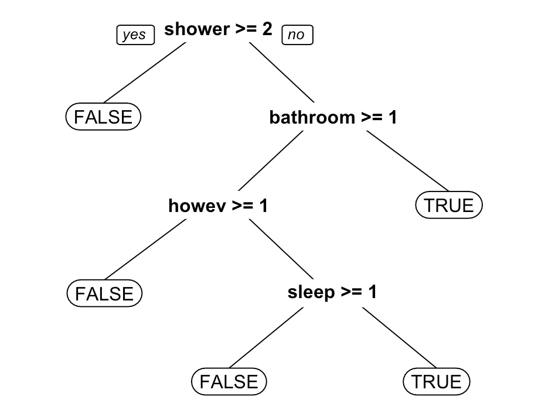

# Predicting Airbnb review scores using text analytics
Airbnb users can leave a review comment and rate their stay on the Airbnb website. This page analyzes the texts of review to build a model that assesses whether any given texts are positive (four or five stars) or negative (one ~ three stars).

### Structure:

1. Data Exploration
2. Text Preprocessing
3. Sparsifying the Corpus
4. Training and Testing
5. Prediction
<br/><br/>


## 1. Data Exploration
The dataset <a href="data/airbnb-small.csv">airbnb-small.csv</a> contains review comments and ratings written for listed lodges in New York City between March 2011 and March 2018.

There are seven variables in the dataset:
- **listing id**: an integer key associated with the listing
- **id**: an integer key associated with the review
- **date**: the date of the review in the format YYYY-MM-DD
- **reviewer id**: an integer key associated with the reviewer
- **reviewer**: the first name of the reviewer
- **comments**: the text of the review
- **review scores rating**: the score that the reviewer gave the listing, with 20 corresponding to one star, and 100 corresponding to five stars

#### Preliminary insights on the review rating

```bash
table(reviews$review_scores_rating)
reviews$nchar = nchar(reviews$comments)
aggregate(reviews$nchar, list(reviews$review_scores_rating), mean)
```
|    Rating    |   Counts   |  Avg. length (chr) |
|:--------:|:------:|:------:|
| 20  |  62  | 464.6  |
| 40  |  56  | 597.73  |
| 60  |  156  | 388.8  |
| 80  |  708  | 276.48  |
| 100  |  3191  | 289.42  |


## 2. Texts preprocessing
The texts are preprocessed based on the following steps:
1. Convert to lowercase
2. Remove punctuation
3. Remove all stop words
4. Remove particular words: 'airbnb'
5. Stem the document


### I. Convert to lowercase
This process converts all the comments to lower case. <i><b>tm_map</b></i> applies an operation to every document in the corpus. In this case, the operation is to lowercase (tolower).

```bash
corpus = Corpus(VectorSource(reviews$comments)) # An array/collection of documents containing texts
corpus[[1]]   # individual doc
strwrap(corpus[[1]]) #strwrap: split the sentence

corpus = tm_map(corpus, tolower)
strwrap(corpus[[1]])
```

|Original|
|:--------|
|[1] "Good stay, a few issues with the direction instructions as they were different from where"  |
|[2]  "the actual property was."  |

|Converted|
|:--------|
|[1] "good stay, a few issues with the direction instructions as they were different from where" |
|[2]  "the actual property was."  |

### II. Remove punctuation
This process removes all the puctuations from the document.

```bash
corpus <- tm_map(corpus, removePunctuation)
strwrap(corpus[[1]])
```

|Original|
|:--------|
|[1] "good stay, a few issues with the direction instructions as they were different from where" |
|[2]  "the actual property was."  |

|Converted|
|:--------|
|[1] "good stay a few issues with the direction instructions as they were different from where"  |
|[2]  "the actual property was"   |

### III. Remove all stop words
This process removes all the stop words, such as 'my', 'me', 'myself', etc. 'stopwords("english")' is a dataframe that contains a list of stop words. 
```bash
corpus = tm_map(corpus, removeWords, stopwords("english"))
# stop words. Let us look at the first ten stop words. 
stopwords("english")[1:10]
# Checking again:  
strwrap(corpus[[1]])
```
|First ten stop words from 'stopwords("english")'|
|:--------|
|"i"         "me"        "my"        "myself"    "we"        "our"       "ours"      "ourselves"     "you"       "your" |


|Original|
|:--------|
|[1] "good stay a few issues with the direction instructions as they were different from where"  |
|[2]  "the actual property was"   |

|Converted|
|:--------|
|[1] "good stay issues direction instructions different actual property"|


### IV. Remove particular words: 'airbnb'
This process removes particular words that are meaningless or unnecessary for the analysis. The list can be updated based on the application context.
```bash
#reviews[grepl("word",reviews$comments),"comments"] #look for comments containing particular word
strwrap(corpus[[162]])
corpus = tm_map(corpus, removeWords, c("airbnb"))
strwrap(corpus[[162]])
```

### V. Stem documents
This process removes the parts of words that are not necessary, such as 'ing', 'ed', 'ion', and so on.
```bash
corpus = tm_map(corpus, stemDocument)
```
|Original|
|:--------|
|[1] "good stay issues direction instructions different actual property"|

|Converted|
|:--------|
|[1] "good stay issu direct instruct differ actual properti"|


### 3. Sparsifying the Corpus
The corpus at this point still contain words that are not helpful due to their specificity, e.g. turquoise, b43, or hosts' names. This process sparsifies the corpus into document-term matrix and removes infrequent words so that we can restrict our attention only to words that occur more frequently.

```bash
# First, calculate the frequency of each words over all tweets. 
frequencies = DocumentTermMatrix(corpus) # constructs a document-term matrix
frequencies   # documents as the rows, terms as the columns

# keep terms that appear in at least 1% of the tweets and
# create a list of these words as follows.
sparse = removeSparseTerms(frequencies, 0.99)  # 0.99: maximal allowed sparsity 
sparse # now there are 404 terms instead of 7,040
```


### 4. Training and Test Split
This process converts the sparsified corpus into a data frame format. Yet, it still does not have a dependent variable, which it aims to predict. Therefore, here it creates a new column for the dependent variable that indicates TRUE if the review is considered positive (review score >= 80).

Lastly, the dataset is splitted into training set where the date is before 2018-01-01 and test set from 2018-01-01 onwords.

```bash
# 1. Convert tf matrix into a data frame
# Each column corresponds to each word (term), 
# Each row corresponds to each document (review)
document_terms = as.data.frame(as.matrix(sparse))
str(document_terms)

# 2. Create a new column for the dependent variable
document_terms$positive_review = reviews$review_scores_rating >= 80
head(reviews)
document_terms$

# 3. Split training and test set
split1 = (reviews$date < "2018-01-01")
split2 = (reviews$date >= "2018-01-01")
train = document_terms[split1,]
test = document_terms[split2,]
```

### 4. Prediction
Here, a CART model for classification is constructed to predict whether a review is positive or negative based only on the text-based features in the dataframe, using the default parameters for cp and minbucket.

```bash
# Construct and plot the CART model.
cart = rpart(positive_review ~ ., data=train, method="class")
prp(cart)

# Assess the out-of-sample performance of the CART model
predictions.cart <- predict(cart, newdata=test, type="class")
matrix.cart = table(test$positive_review, predictions.cart) # confusion matrix
accuracy.cart = (matrix.cart[1,1]+matrix.cart[2,2])/nrow(test)
# True Positive Rate (TPR) and False Positive Rate (FPR)
TPR.cart = (matrix.cart[2,2])/sum(matrix.cart[2,])
FPR.cart = (matrix.cart[1,2])/sum(matrix.cart[1,])
```



In the constructed tree, if the word 'shower' is used more than twice in the review, the rating is considered negative. However, if 'shower' is used 0 or 1 time, then the tree looks at the word 'bathroom' to determine whether the review is positive or negative.

#### Confusion matrix ('matrix.cart')
<table>
  <tr align='center' style="font-weight:bold">
    <td></td>
    <td>FALSE</td>
    <td>TRUE</td>
  </tr>
  <tr align='center'>
    <td align='center' style="font-weight:bold">FALSE</td>
    <td>5</td>
    <td>36</td>
  </tr>
  <tr align='center'>
    <td align='center' style="font-weight:bold">TRUE</td>
    <td>4</td>
    <td>940</td>
  </tr>
</table>

Accuracy : 0.9594 </br>
False Positive Rate (FPR): 0.8781</br>
True Positive Rate (TPR): 0.9958</br>


### Comparison with baseline model where all reviews are classified as positive
Here, the accuracy of CART model in predicting the out-of-sample is compared with a simple baseline model where all reviews are classified as positive.

```bash
##### Baseline: all reviews are classified as positive
accuracy.baseline = sum(test$positive_review)/nrow(test)
TPR.baseline = 1
FPR.baseline = 1

#Summary of performance
summary.performance <- data.frame (
  accuracy=round(c(accuracy.baseline,accuracy.cart),3),
  TPR=round(c(TPR.baseline,TPR.cart),3),
  FPR=round(c(FPR.baseline,FPR.cart),3))
summary.performance
```

### Summary of performance
<table>
  <tr align='center' style="font-weight:bold">
    <td></td>
    <td>Accuracy</td>
    <td>TPR</td>
    <td>FPR</td>
  </tr>
  <tr align='center'>
    <td style='font-weight:bold'>Baseline</td>
    <td>0.958</td>
    <td>1.000</td>
    <td>1.000</td>
  </tr>
  <tr align='center'>
    <td style='font-weight:bold'>CART</td>
    <td>0.959</td>
    <td>0.996</td>
    <td>0.878</td>
  </tr>
</table>

The summary table compares the out-of-sample performance of CART models to this baseline.

Note that both the True Positive Rate and the False Positive Rate are very large (90% or higher). This is because the vast majority of ratings are positive in the dataset, so the predictive model errs on the side of classifying reviews as positive ones rather than negative ones. One can thus have very strong confidence in the prediction when a review is classified as positive, while a negative flag should be interpreted with more caution.